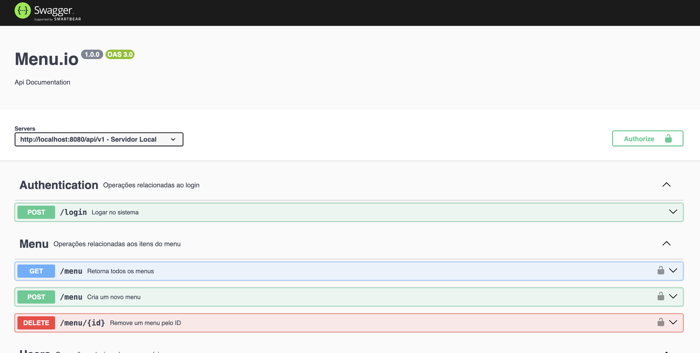

# 🍽️ Cardápio Digital - Backend

Backend do sistema de cardápio digital, desenvolvido com **Node**, **MongoDB**, **TypeScript**, **Express**, *
*Autenticação com JWT** e estruturado com o padrão arquitetural.



### Clonando

```bash
git clone https://github.com/christian-de-ornellas/menuio-backend.git
cd menuio-backend
```

### Instalando os pacotes

via yarn:
`yarn`

via npm:
`npm install`

### Executando o serviço

via yarn:
`yarn dev`

via npm:
`npm run dev`

### Feedback no terminal

`Servidor rodando na porta 8080`
Tecnologias: TypeScript, Node.js, Express, MongoDB e Swagger

### Documentação

copie e cole no seu navegador
`http://localhost:8080/api/v1/docs`

#### Obs: O upload de imagens está sendo armazenado localmente, futuramente seria ideal implementar um aws s3 ou outro
storage

# Licensa

Distribuído sob a licença MIT. Veja LICENSE para mais informações.

Feito com ❤️ por Christian Possidonio
